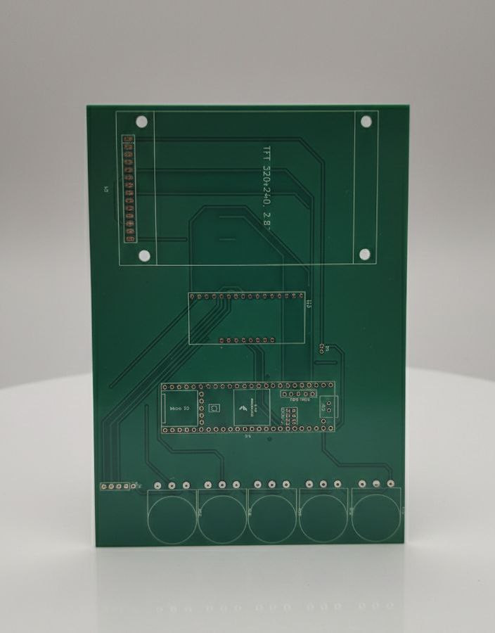

# Yottasynth

Yottasynth is an under-development digital synthesizer. It is an open hardware
project built around an ARM microcontroller, with custom hardware, 3D-printed
parts, and ongoing firmware development.

## Status

This is a work-in-progress journey to build a full synth.

## Hardware + 3D

- Board design files: `etc/board/` (open with KiCad)
- Enclosure STL files: `etc/enclosure/` (print with your slicer app)
- Touch screen interface and ARM-based digital synth core

## Contributing

Contributions are welcome. Feel free to open an issue or a PR if you want to
help with firmware, hardware, or design.

## Issues

If you spot a bug or want to request a feature, please create an issue:
https://github.com/yottanami/yottainst/issues/new

## Repo Layout

- `src/`: firmware source code
- `include/`: headers
- `lib/`: libraries
- `test/`: tests
- `etc/`: hardware and 3D design sources

## Contact

https://yottanami.com

## Buy Me a Coffee

- GitHub Sponsors: https://github.com/sponsors/yottanami
- Ko-fi: https://ko-fi.com/yottanami
