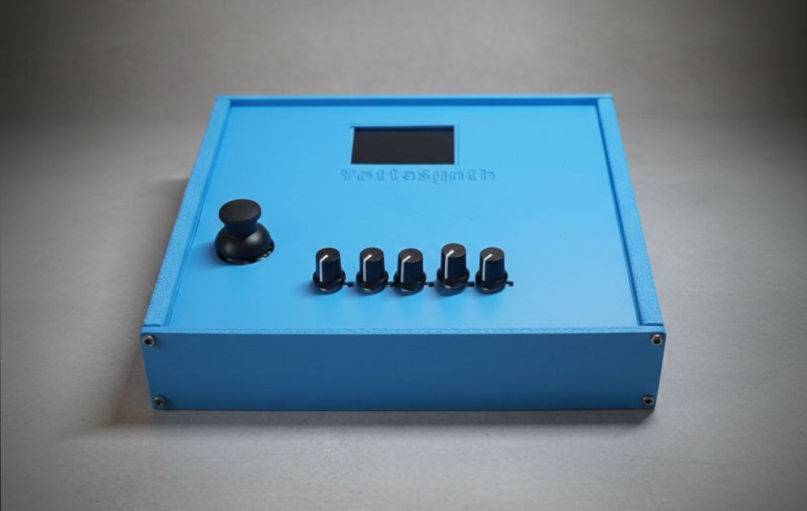
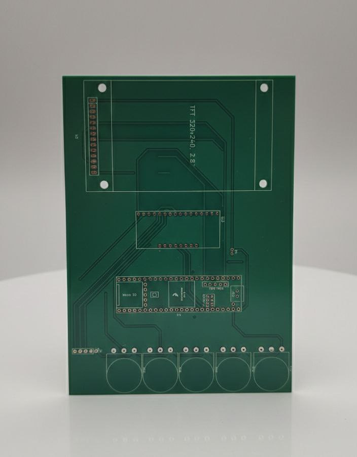
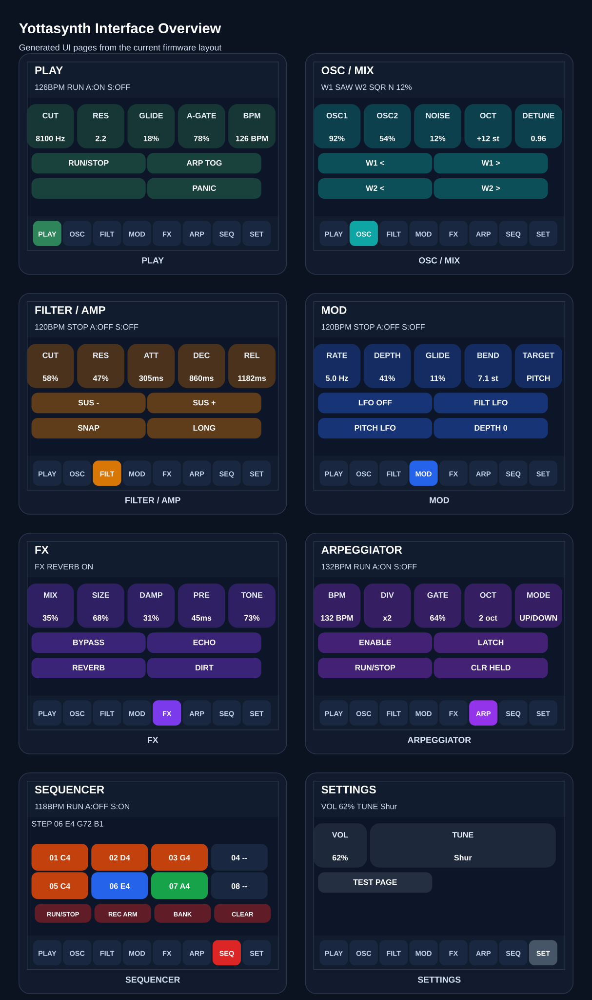

# Yottasynth: Open Hardware Touchscreen Synth with Persian/Iranian Tunings

Yottasynth is an open hardware touchscreen synth with a compact page-based control surface, five context-sensitive knobs, an arpeggiator, a step sequencer, and support for Persian/Iranian music tunings.

یوتاسینث یک سینت‌سایزر دیجیتال متن‌باز با رابط لمسی، سکوئنسر، آرپژیاتور و پشتیبانی از کوک‌های موسیقی ایرانی است. این ساز امکان انتخاب کوک‌های مرتبط با دستگاه‌ها و آوازهای ایرانی را فراهم می‌کند تا برای اجرا و طراحی صدا در فضای موسیقی ایرانی مناسب‌تر باشد.




## What It Is

The current firmware is a playable mono synth instrument with:

- a touch-first panel UI
- five context-sensitive knobs
- arpeggiator
- 16-step sequencer
- three effect modes: `Echo`, `Reverb`, and `Drive`
- selectable Persian scale tunings

## Current Features

- `PLAY`, `OSC`, `FILT`, `MOD`, `FX`, `ARP`, `SEQ`, and `SET` pages
- mono synth voice with dual oscillators, noise, filter, envelope, glide, and LFO
- page-specific touch actions and knob mappings
- internal BPM transport, or external MIDI clock sync over USB
- arpeggiator with mode, division, gate, octave range, and latch
- 16-step sequencer with step selection, bank switching, swing, and live MIDI record
- effect editing with page-dependent controls
- output volume, tuning, and clock-source (internal / external) selection from the settings page
- Persian scale support through alternate tunings
- touch screen used for navigation and `OK / Confirm` actions

## Persian / Iranian Tunings

The current tuning list includes:

- `Standard` (`استاندارد`)
- `Shur` (`شور`)
- `Abuata` (`ابوعطا`)
- `Dashti` (`دشتی`)
- `Bayat-e Tork` (`بیات ترک`)
- `Afshari` (`افشاری`)
- `Segah` (`سه‌گاه`)
- `Chahargah` (`چهارگاه`)
- `Homayun` (`همایون`)
- `Bayat-e Esfahan` (`بیات اصفهان`)
- `Nava` (`نوا`)
- `Mahur` (`ماهور`)
- `Rast-Panjgah` (`راست‌پنجگاه`)

## How It Works

Yottasynth is organized as one compact panel split into pages. The touch screen is used to switch pages and trigger actions, while the five physical knobs always control the five parameters shown on screen for the current page.

In normal use, a MIDI controller feeds notes into the synth engine through USB host MIDI. You shape the sound on the synth pages, switch to `ARP` for rhythmic note patterns, use `SEQ` for step programming and live record, and adjust global volume or tuning in `SET`. When a destructive action needs confirmation, a second tap on the armed button acts as `OK`.

The transport (sequencer and arpeggiator) normally runs on its own internal BPM. Set `SYNC` to `EXT` on the `SET` page to slave it to an external MIDI clock over USB instead. Two USB paths are supported without any hardware change:

- the **USB host port** (alongside the keyboard, through a USB hub) for standalone gear such as an Ableton Move
- the **native USB port** (the same cable used to upload firmware) for a computer / DAW such as Ableton Live

In external mode the synth follows the host's tempo and its start / stop / continue transport.

## Interface Summary

- top bar: page title plus compact status
- middle panel: parameter cards and touch actions
- bottom bar: eight color-coded tabs

Page layout:

- `PLAY`: quick performance controls
- `OSC`: oscillator mix, noise, octave, detune, and waveform changes
- `FILT`: filter and envelope shaping
- `MOD`: LFO, bend range, and modulation target
- `FX`: echo, reverb, or drive editing
- `ARP`: arpeggiator setup
- `SEQ`: 16-step sequencing
- `SET`: output volume, tuning, clock source (internal / external sync), and input test entry

## User Guide

For a user-perspective walkthrough of the panel, controls, pages, and sequencing flow, see [docs/user-guide.md](docs/user-guide.md).

For developer-facing documentation of the firmware structure and code, see:

- [docs/README.md](docs/README.md)
- [docs/source-reading-guide.md](docs/source-reading-guide.md)
- [docs/codebase-guide.md](docs/codebase-guide.md)

## Screenshots



To export screenshots of the current screen pages without running the device firmware:

```bash
python3 scripts/generate_screenshots.py
```

This writes one SVG per page, a stitched `overview.svg` for the README, and a simple preview index into `docs/screenshots/`.

## Hardware + 3D

- board design files: `etc/board/`
- touch-driven panel firmware: `src/`
- headers and shared definitions: `include/`
- project docs: `docs/`

## Status

This is still an active work-in-progress project, but the firmware already implements the main instrument shell and core performance workflow.

## Contributing

Contributions are welcome. Feel free to open an issue or a PR if you want to help with firmware, hardware, or design.

## Issues

https://github.com/yottanami/yottainst/issues/new

## Contact

https://yottanami.com

## Support

- GitHub Sponsors: https://github.com/sponsors/yottanami
- Ko-fi: https://ko-fi.com/yottanami
